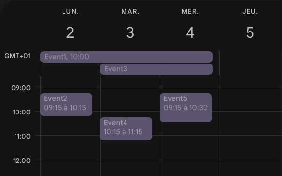
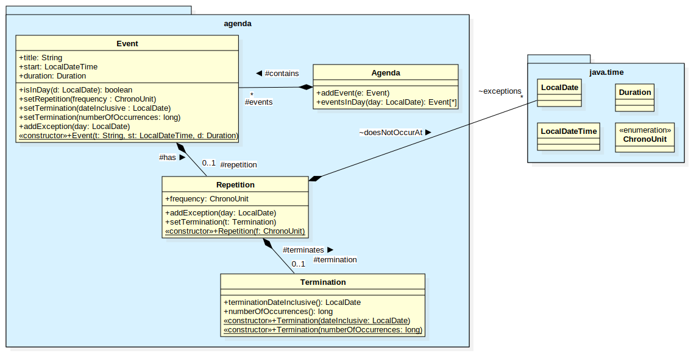
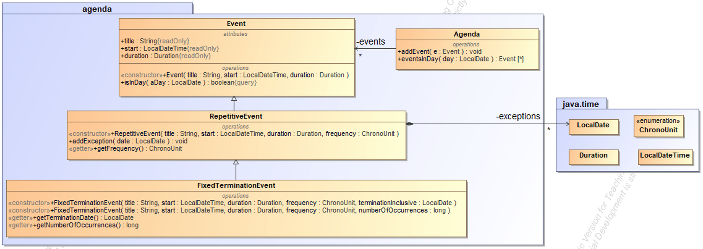

# Exercice : un agenda

## Sommaire
- [Spécifications](#Spécifications)
- [Question 1 - Implémentation (15 points)](#Implémentation)
- [Question 2 - UML (5 points)](#UML)

## Spécifications
On se propose de concevoir un agenda, contenant une liste d'événements. Les fonctionnalités attendues sont les suivantes :

L’agenda contient des événements (`Event`). Pour un événement, on doit pouvoir définir son titre, son instant de début ([LocalDateTime](https://docs.oracle.com/javase/8/docs/api/java/time/LocalDateTime.html)) et sa durée ([Duration](https://docs.oracle.com/javase/8/docs/api/java/time/Duration.html)).

Les événements simples se produisent une seule fois, mais peuvent éventuellement se répéter.

- Les événements répétitifs ont une fréquence de répétition : ils peuvent être répétés chaque jour ([ChronoUnit](https://docs.oracle.com/javase/8/docs/api/java/time/temporal/ChronoUnit.html).DAYS), chaque semaine ([ChronoUnit](https://docs.oracle.com/javase/8/docs/api/java/time/temporal/ChronoUnit.html).WEEKS), ou chaque mois ([ChronoUnit](https://docs.oracle.com/javase/8/docs/api/java/time/temporal/ChronoUnit.html).MONTHS).
- Pour un événement répétitif, on peut définir des exceptions, c'est-à-dire des dates ([LocalDate](https://docs.oracle.com/javase/8/docs/api/java/time/LocalDate.html)) où une répétition planifiée ne se produira pas (par exemple, un événement se produit tous les jours sauf le 1/1/2021).

Par défaut, les événements répétitifs se répètent indéfiniment (par exemple noël tous les 25 décembre), mais on veut également représenter une autre forme d’événements : Des événements répétitifs qui ne se répètent pas indéfiniment, mais pour lesquels on peut fixer la terminaison :

- Ces événements peuvent se répéter un nombre prédéfini de fois (par exemple répéter 3 x un événement hebdomadaire), ou, de manière équivalente,
- se répéter jusqu’à une date donnée (par exemple, répéter un événement mensuel jusqu’au 31/12/2021).



_Figure 1 : les événements peuvent s'étendre sur plusieurs jours_

On doit pouvoir :

- Ajouter de nouveaux événements à l’agenda,
- Trouver tous les événements qui se produisent à une date donnée. Attention, 
on doit prendre en compte le fait qu’un événement peut s’étendre sur 
plusieurs jours. Ainsi, dans l’exemple de la Figure 1, les événements Event1, Event3 et Event4 se produisent le mardi 3. On doit également prendre en compte les événements répétitifs dans ce calcul.

Ces spécifications donnent lieu au diagramme de classe UML illustré en Figure 2.



Figure 2 : Modèle UML

## Travail à réaliser

### Implémentation
À partir de ce point de départ, implémenter ce diagramme UML de manière à faire passer les tests unitaires inclus.

Les tests unitaires fournis ne doivent pas être modifiés. Dans le point de départ fourni, 
vous pouvez ajouter classes, méthodes ou propriétés que vous trouverez nécessaire. 
Dans ce cas, ils doivent être également reportés dans le diagramme de classe [fourni](./doc) dans le répertoire `doc` (sauf getters et setters). Vous devez arriver à une couverture de test de 100 % et vous pouvez également ajouter d’autres classes de test si nécessaire.

### Questions complémentaires
Implémenter et tester les deux méthodes suivantes dans la classe Agenda

```java
    /**
     * Trouver les événements de l'agenda en fonction de leur titre
     * @param title le titre à rechercher
     * @return les événements qui ont le même titre
     */
    public List<Event> findByTitle(String title) {
        // TODO : implémenter cette méthode
        throw new UnsupportedOperationException("Pas encore implémenté");        
    }
    
    /**
     * Déterminer s’il y a de la place dans l'agenda pour un événement (aucun autre événement au même moment)
     * @param e L'événement à tester (on se limitera aux événements sans répétition)
     * @return vrai s’il y a de la place dans l'agenda pour cet événement
     */
    public boolean isFreeFor(Event e) {
        // TODO : implémenter cette méthode
        throw new UnsupportedOperationException("Pas encore implémenté");        
    }
```

#### Éléments de solution

Cet exercice fait une utilisation intensive des classes du package [java.time](https://docs.oracle.com/javase/8/docs/api/java/time/package-frame.html) pour représenter et manipuler les données temporelles (dates, durées…). Quelques exemples de code :
```java
// Une date, ex : 1° novembre 2020
LocalDate d1 = LocalDate.of(2020, 11, 1);

// Date et heure, 1° novembre 2020, 22:30
LocalDateTime dt = LocalDateTime.of(2020, 11, 1, 22, 30);

// Une durée : 120 minutes
Duration m = Duration.ofMinutes(120);

// Ajouter (plus) ou soustraire (minus) des durées à une date
LocalDate d2 = d1.minus(1, ChronoUnit.WEEKS);

// Le nombre de jours entre deux dates
long j = ChronoUnit.DAYS.between(d1, d2); // -7 jours
```
### UML
Un autre ingénieur propose une solution alternative en UML :



_Figure 3 : autre modèle UML_

Comparer ces deux solutions en argumentant leurs avantages ou inconvénients respectifs. Ecrire vos réponses dans [./doc/questionUML.txt](./doc/questionUML.txt).

